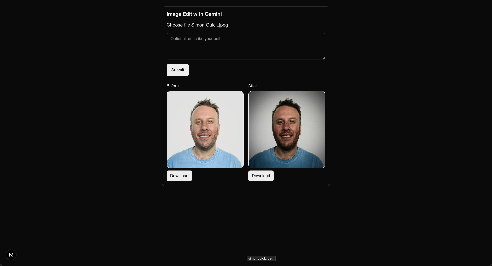

# Photo Boost — Leica Look with Gemini 2.5 Flash Image

Premium, mobile‑first photo enhancement using Next.js + AI SDK + Google Gemini 2.5 Flash Image. Capture or upload a photo, optionally add instructions, and receive a Leica M‑series inspired edit with analog color science, micro‑contrast “pop”, and fine film grain. Includes before/after previews, compare slider, lightbox, downloads, and in‑app camera capture with confirmation.



## Features

- Leica aesthetic edit powered by `gemini-2.5-flash-image-preview` (image output enabled)
- Upload or capture from device camera (with user confirm before sending)
- Optional instruction text (≤ 500 chars)
- Responsive before/after previews with lightbox and downloads
- Full‑screen compare slider overlay (drag to scrub between before/after)
- Robust error states and file validation (type/size)
- CORS support for future mobile clients

## Tech Stack

- Next.js 15 (App Router, Route Handlers, Node runtime)
- TypeScript (strict), Tailwind CSS
- AI SDK: `ai`, `@ai-sdk/google`
- UI: shadcn‑style primitives (in‑repo components) + custom CSS
- Validation: `zod`

## Requirements

- Node.js 18+ (Node 22 recommended)
- pnpm
- Google Generative AI API key with access to Gemini 2.5 Flash Image

## Quick Start

1) Install dependencies

```bash
pnpm install
```

2) Configure environment

Create `.env.local` with:

```
GOOGLE_GENERATIVE_AI_API_KEY=YOUR_KEY
ALLOWED_ORIGINS=http://localhost:3000
MAX_UPLOAD_MB=8
```

3) Run the dev server

```bash
pnpm dev
```

Open http://localhost:3000

## API

- Endpoint: `POST /api/image/process`
- Content-Type: `multipart/form-data`

Request fields:

- `image` (File, required): png/jpg/webp, ≤ `MAX_UPLOAD_MB` MiB
- `instruction` (string, optional): extra edits (e.g., “soften shadows”)

Successful response (200):

```json
{
  "imageBase64": "...",
  "mimeType": "image/png" | "image/webp" | "image/jpeg",
  "safety": { "blocked": false } // provider metadata (if available)
}
```

Error (4xx/5xx):

```json
{ "error": "message" }
```

Curl smoke test:

```bash
curl -X POST http://localhost:3000/api/image/process \
  -F image=@/path/to/picture.jpg \
  -F instruction='soften shadows'
```

## Prompting

- System prompt lives in `src/lib/prompt.js` and is crafted using Google’s best practices for image generation/editing:
  - Clear role and objective
  - Style guidelines (tone, micro‑contrast, film grain, bokeh, vignette)
  - Constraints (identity, composition preserved; no watermarks/text)
  - Edit order guidance and special cases
- The prompt is applied as both the system instruction and the first user text part for robust provider handling.

## UX Details (Mobile‑First)

- Drag‑and‑drop upload or tap to upload
- “Use Camera” launches a secure in‑app camera modal
  - Capture → Confirm (Use Photo/Retake) → Send to API
- Before/After grid (stacks on mobile, 2‑col on desktop)
- Lightbox for large preview
- Compare Slider overlay with draggable handle
- Download buttons per image

## Project Structure

```
src/
  app/
    api/image/process/route.ts   # API route → Gemini → base64 image JSON
    page.tsx                     # Main page
  components/
    upload-card.tsx              # Main UI, camera modal, compare, previews
    compare-slider.tsx           # Full-screen compare overlay
    ui/                          # Basic shadcn-style primitives
  lib/
    gemini.ts                    # Google provider init
    schema.ts                    # zod validation
    cors.ts                      # CORS helper
    prompt.js                    # System prompt
  types/
    image.ts                     # API response types
```

## Development

```bash
pnpm dev       # run locally
pnpm lint      # eslint
pnpm typecheck # tsc --noEmit
pnpm test      # placeholder
```

## Security & Privacy

- No server‑side persistence; images are processed in‑memory
- PII/photos are not logged
- Strict validation for file type and size
- CORS can be restricted via `ALLOWED_ORIGINS`

## Troubleshooting

- 400 “Invalid image data from model”: ensure the deployed model returns `files` with `base64`. We use AI SDK’s `GeneratedFile.base64`.
- Camera not working: requires HTTPS or localhost; check browser permissions and `facingMode` availability.
- Slow responses: large images take longer; keep uploads ≤ 8 MiB. Target end‑to‑end < 10s under typical conditions.

## Roadmap

- Persistence (S3/GCS) and shareable links
- Simple rate limiting and auth
- More styles (BW Tri‑X profile, portrait/landscape presets)
- Playwright E2E for mobile camera flow

---

Made with Next.js, AI SDK, and Gemini 2.5 Flash Image.
